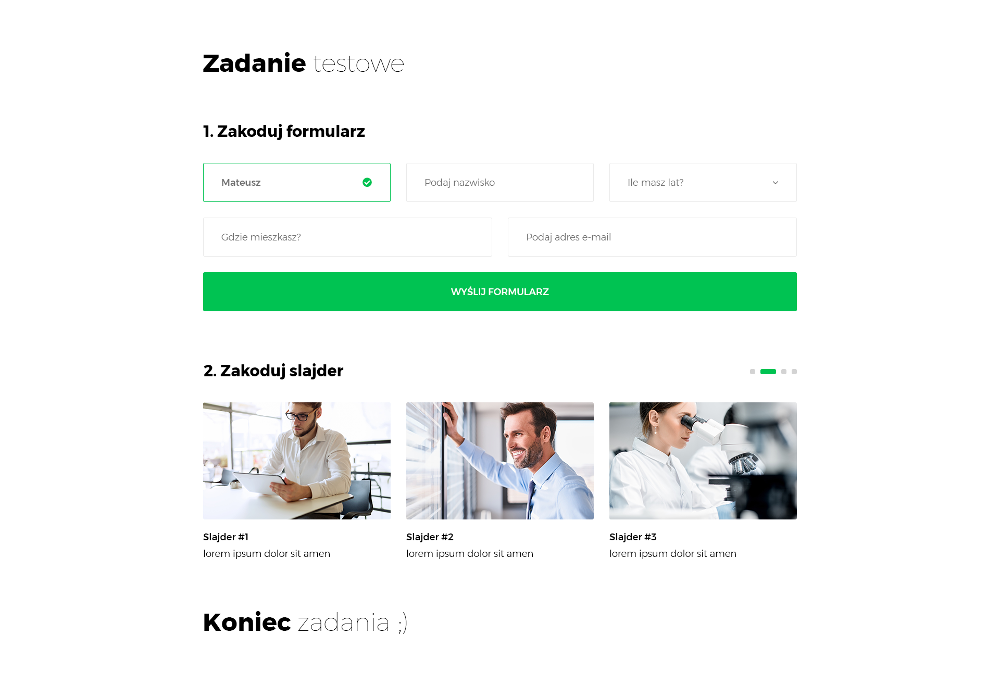

# Recruitment-task
Recruitment task for the [1innosystems]

### About
UI is based on Photoshop file which I got. Front end is based on Vue.js ( SPA ), while Back end is based on Node.js with Express.js and NoSQL database MongoDB. I created REST API for communication between Front end and Back end. Aplication requires MongoDB local server. In the same moment you can run 2 applications, because CORS is setted and ports are different (8080 and 4000)

### Features
- Responsive website
- Reactive validation for form
- AJAX Https Request for the server by REST API endpoint
- RESP API Back-End
- Responsive slider based on dynamic data
- Saving data to Mongo NoSQL database on localhost server
- Alert component which responds for the AJAX request ( success & error )



### Used libraries/Technologies:
  - Vue.js 2
  - SCSS
  - Javascript
  - Axios Ajax librabry
  - Vee Validate
  - Vue Carousel
  - Bootstrap Vue
  - Node.js
  - Express.js
  - MongoDB
  - ES6+

## Front End
Node.js is requires to run this application. Basically Website is based on SPA with Vue.js and Babel. App has b

### Install
```sh
$ cd front-end
$ npm install
```

### Run

```sh
$ npm run serve
```

### Build

```sh
$ npm run build
```

## Back End
Node.js and MongoDB local server is requires to run this application correctly. I tried to write back-end with Javascript ES6/ES7 newest features like Async/Await, arrow functions and etc. There is one model for database ( users model ), one controller for users, and 2 API end points ( POST & GET ). I didn't add more API end points, because they weren't necessary. However application is modular, because is based on MVC design pattern, therefore the development of application is simple and logic.

| HTTP method | URI path | Description |
| ------ | ------ | | ------ |
| POST | /api/users |  Add user to the database |
| GET | /api/users |  Retrieves all users from database |

### Install

```sh
$ cd back-end
$ npm install
```

### Run

```sh
$ npm run dev
```

### Build

```sh
$ npm run build
```

[1innosystems]: http://1innosystems.com/